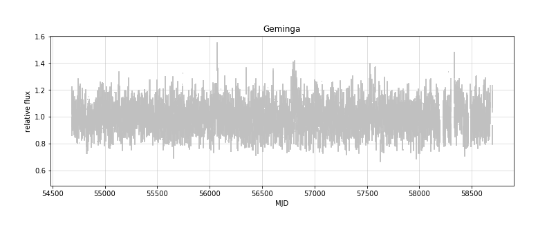
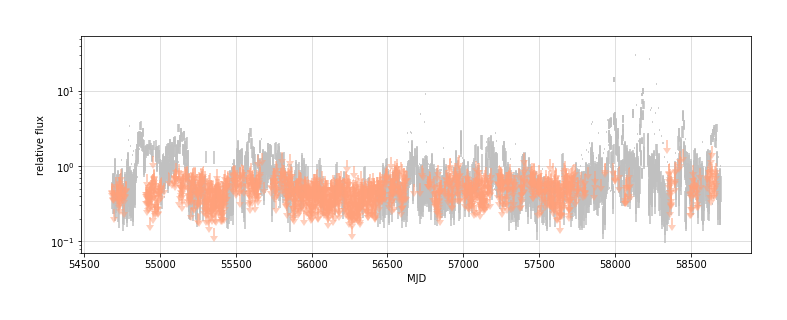

# The `light_curve` package
> Code for generating fermi-LAT light curves


## Background

This package has code that is being adapted to the [nbdev](https://nbdev.fast.ai/) environment from [github package lat-timing](https://github.com/tburnett/lat-timing) to manage light curves of Fermi-LAT sources.  

An At the same time, I've ported some code from  my [jupydoc](https://github.com/tburnett/jupydoc) documention package to allow enhanced documentation combining Markdown and code. 

## Install
After cloning, in its folder run the command
`pip install -e .`


## Demonstrate some actual light curves
 
 
<details class="description">
    <summary>Code details ...</summary>
    
```python
#collapse_hide

def plot_demo():
    """
    ### Light curve plots
    
    Test with {source1.name}:
    
    {fig1}
    
    and {source2.name}
    
    {fig2}
    
    Printout:
    {print_out}
    """
    from light_curves.config import Config, Files, PointSource
    from light_curves.lightcurve import get_lightcurve, flux_plot
    
    config = Config()
    files = Files()
    
    with capture_print() as print_out:
        source1 = PointSource('Geminga')
        lc1 = get_lightcurve(config, files, source1)
        fig1 = flux_plot(config, lc1, fignum=1, title=source1.name)
        fig1.caption=f'{source1.name}'

        source2 = PointSource('3C 279')
        lc2 = get_lightcurve(config, files, source2)
        fig2 = flux_plot(config, lc2, fignum=2, yscale='log' )
        fig2.caption=f'{source2.name}'

nbdoc(plot_demo)
```

</details>


### Light curve plots

Test with Geminga:

<div class="jupydoc_fig"><figure>     <figcaption><b>Figure 1</b>. Geminga</figcaption></figure></div>


and 3C 279

<div class="jupydoc_fig"><figure>     <figcaption><b>Figure 2</b>. 3C 279</figcaption></figure></div>


Printout:
<p style="margin-left: 5%"><pre>Restoring the light curve from /tmp/light_curves/Geminga_lightcurve.pkl <br>Restoring the light curve from /tmp/light_curves/3C_279_lightcurve.pkl <br></pre></p>


