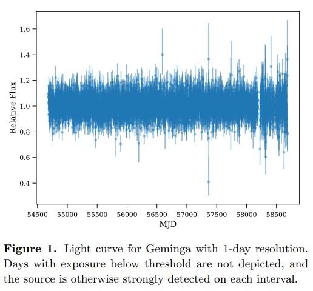

# The `light_curve` package
> Code for generating fermi-LAT light curves. <a href='https://tburnett.github.io/light_curves/'>link to this document</a>


## Background

This package has code that is being adapted to the [nbdev](https://nbdev.fast.ai/) environment from [github package lat-timing](https://github.com/tburnett/lat-timing) to manage light curves of Fermi-LAT sources.  

As pointed out there, it is based on a [paper](https://arxiv.org/pdf/1910.00140.pdf) by Matthew Kerr, 

And at the same time, I've ported some code from  my [jupydoc](https://github.com/tburnett/jupydoc) documention package to allow enhanced documentation combining Markdown and code. This is demonstrated below.

## Installation
After cloning, in its folder run the command
`pip install -e .`

## Instructions on set up / use

`instructions`

## Demonstrate some actual light curves
 
 
<details class="description">
    <summary>Code details ...</summary>
    
```python
#collapse_hide

def plot_demo():
    """
    ### Light curve plots
    
    {print_out}
    
    <br>
    Test with {source1.name}:
    
    {fig1}
    
    This is to be compared with Kerr's Figure 1:
    
    {kerr_fig1}
    
    This flaring AGN, {source2.name} was used in the Kerr paper as well.
    
    {fig2}
    
 
    """
    from light_curves.config import Config, Files, PointSource
    from light_curves.lightcurve import get_lightcurve, flux_plot
    
    config = Config()
    files = Files()
    assert files.valid
    #files.clear_cache()
    
    kerr_fig1 = image('kerr_fig1.png')
    
    with capture_print(summary='printout from this analysis') as print_out:
        source1 = PointSource('Geminga')
        lc1 = get_lightcurve(config, files, source1)
        fig1 = flux_plot(config, lc1, fignum=1, title=source1.name)
        fig1.caption=f'{source1.name}'

        source2 = PointSource('3C 279')
        lc2 = get_lightcurve(config, files, source2)
        fig2 = flux_plot(config, lc2, fignum=2, yscale='log' )
        fig2.caption=f'{source2.name}'


from light_curves.config import Files
if Files().valid:
    nbdoc(plot_demo)
```

</details>

    ***fig_folders: ['', '../docs']
    ***fig_folders: ['', '../docs']


### Light curve plots

<details class="descripton" ><summary data-open="Hide " data-close="Show "> printout from this analysis </summary> <p style="margin-left: 5%"><pre>Processing 11 FITS files with GTI information ...  11 files, 63635 intervals with 3,322 days live time<br>	GTI MJD range: 54682.66-58698.08, good fraction 0.83 <br>Loading  132 months from Arrow dataset /home/burnett/data/dataset<br>....................................................................................................................................<br>	Selected 1313726 photons within 5 deg of  (195.13,4.27)<br>	Energies: 100.0-1000000 MeV<br>	Dates:    2008-08-04 15:46 - 2019-08-03 01:17<br>	MJD  :    54682.7          - 58698.1         <br>saving photon data to /tmp/light_curves/Geminga_photons.pkl<br>Load weights from file /mnt/c/users/thbur/OneDrive/fermi/weight_files/Geminga_weights.pkl<br>	Found: PSR J0633+1746 at (195.14, 4.27)<br>	Applyng weights: 240 / 1313726 photon pixels are outside weight region<br>	233109 weights set to NaN<br>Processing 11 FITS files with GTI information ...  11 files, 63635 intervals with 3,322 days live time<br>	GTI MJD range: 54682.66-58698.08, good fraction 0.83 <br>Processing 12 S/C history (FT2) files<br>  applying cuts cos(theta) < 0.4,  z < 100<br>	file /home/burnett/work/lat-data/ft2/ft2_2008.fits: 362996 entries, 360944 in GTI<br>	file /home/burnett/work/lat-data/ft2/ft2_2009.fits: 874661 entries, 870446 in GTI<br>	file /home/burnett/work/lat-data/ft2/ft2_2010.fits: 889547 entries, 884697 in GTI<br>	file /home/burnett/work/lat-data/ft2/ft2_2011.fits: 882832 entries, 871672 in GTI<br>	file /home/burnett/work/lat-data/ft2/ft2_2012.fits: 881317 entries, 868109 in GTI<br>	file /home/burnett/work/lat-data/ft2/ft2_2013.fits: 885307 entries, 867342 in GTI<br>	file /home/burnett/work/lat-data/ft2/ft2_2014.fits: 894730 entries, 886570 in GTI<br>	file /home/burnett/work/lat-data/ft2/ft2_2015.fits: 890006 entries, 886086 in GTI<br>	file /home/burnett/work/lat-data/ft2/ft2_2016.fits: 890933 entries, 884823 in GTI<br>	file /home/burnett/work/lat-data/ft2/ft2_2017.fits: 888349 entries, 883761 in GTI<br>	file /home/burnett/work/lat-data/ft2/ft2_2018.fits: 842824 entries, 830723 in GTI<br>	file /home/burnett/work/lat-data/ft2/ft2_2019.fits: 737029 entries, 514657 in GTI<br>	Found 9,609,830 S/C entries:  2,695,715 remain after zenith and theta cuts<br>Calculate exposure using the energy domain 100.0-1000000.0 4 bins/decade<br>saving exposure to /tmp/light_curves/Geminga_exposure.pkl<br>Time bins: 4015 intervals of 1 days, in range (54683.0, 58698.0)<br>Loaded 3873 / 4015 cells with exposure > 0.3 for light curve analysis<br>Fitting likelihoods with poisson representation<br>Saving the light curve at /tmp/light_curves/Geminga_lightcurve.pkl <br>Processing 11 FITS files with GTI information ...  11 files, 63635 intervals with 3,322 days live time<br>	cut from 63,635 to 7 - 63634, or 63,627 entries after MJD range selection<br>	GTI MJD range: 54683.16-58698.03, good fraction 0.83 <br>Loading  132 months from Arrow dataset /home/burnett/data/dataset<br>....................................................................................................................................<br>	Selected 215138 photons within 5 deg of  (305.10,57.06)<br>	Energies: 100.0-1000000 MeV<br>	Dates:    2008-08-05 04:39 - 2019-08-01 12:09<br>	MJD  :    54683.2          - 58696.5         <br>saving photon data to /tmp/light_curves/3C_279_photons.pkl<br>Load weights from file /mnt/c/users/thbur/OneDrive/fermi/weight_files/3C_279_weights.pkl<br>	Found: P88Y3243 at (305.10, 57.07)<br>	Applyng weights: 2086 / 215138 photon pixels are outside weight region<br>	67649 weights set to NaN<br>Processing 11 FITS files with GTI information ...  11 files, 63635 intervals with 3,322 days live time<br>	cut from 63,635 to 7 - 63634, or 63,627 entries after MJD range selection<br>	GTI MJD range: 54683.16-58698.03, good fraction 0.83 <br>Processing 12 S/C history (FT2) files<br>  applying cuts cos(theta) < 0.4,  z < 100<br>	file /home/burnett/work/lat-data/ft2/ft2_2008.fits: 362996 entries, 360200 in GTI<br>	file /home/burnett/work/lat-data/ft2/ft2_2009.fits: 874661 entries, 870446 in GTI<br>	file /home/burnett/work/lat-data/ft2/ft2_2010.fits: 889547 entries, 884697 in GTI<br>	file /home/burnett/work/lat-data/ft2/ft2_2011.fits: 882832 entries, 871672 in GTI<br>	file /home/burnett/work/lat-data/ft2/ft2_2012.fits: 881317 entries, 868109 in GTI<br>	file /home/burnett/work/lat-data/ft2/ft2_2013.fits: 885307 entries, 867342 in GTI<br>	file /home/burnett/work/lat-data/ft2/ft2_2014.fits: 894730 entries, 886570 in GTI<br>	file /home/burnett/work/lat-data/ft2/ft2_2015.fits: 890006 entries, 886086 in GTI<br>	file /home/burnett/work/lat-data/ft2/ft2_2016.fits: 890933 entries, 884823 in GTI<br>	file /home/burnett/work/lat-data/ft2/ft2_2017.fits: 888349 entries, 883761 in GTI<br>	file /home/burnett/work/lat-data/ft2/ft2_2018.fits: 842824 entries, 830723 in GTI<br>	file /home/burnett/work/lat-data/ft2/ft2_2019.fits: 737029 entries, 514550 in GTI<br>	Found 9,608,979 S/C entries:  2,438,717 remain after zenith and theta cuts<br>Calculate exposure using the energy domain 100.0-1000000.0 4 bins/decade<br>saving exposure to /tmp/light_curves/3C_279_exposure.pkl<br>Time bins: 4014 intervals of 1 days, in range (54683.0, 58697.0)<br>Loaded 3845 / 4014 cells with exposure > 0.3 for light curve analysis<br>Fitting likelihoods with poisson representation<br>Saving the light curve at /tmp/light_curves/3C_279_lightcurve.pkl <br></pre></p> </details>

<br>
Test with Geminga:

<div class="jupydoc_fig"><a href="images/plot_demo_fig_01.png"<figure>     <figcaption><b>Figure 1</b>. Geminga</figcaption></figure></a></div>


This is to be compared with Kerr's Figure 1:

<div class="jupydoc_fig"> <a href="images/kerr_fig1.png">  <figure>    
  <figcaption></figcaption></figure></a></div>


and 3C 279

<div class="jupydoc_fig"><a href="images/plot_demo_fig_02.png"<figure>     <figcaption><b>Figure 2</b>. 3C 279</figcaption></figure></a></div>


